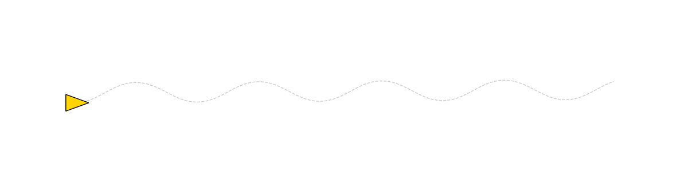
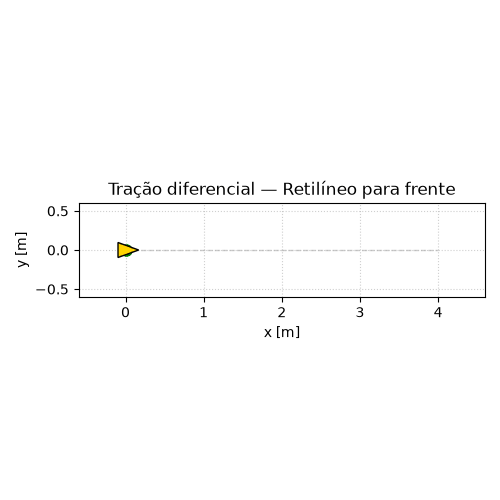
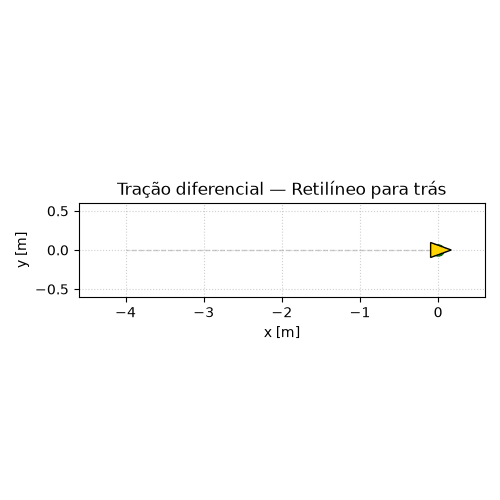
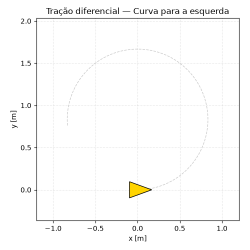
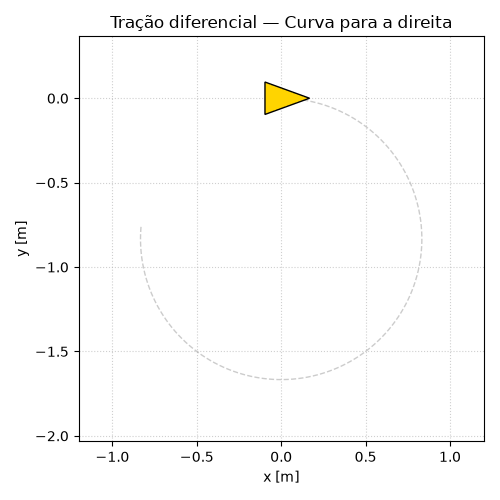
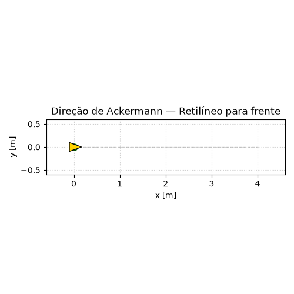
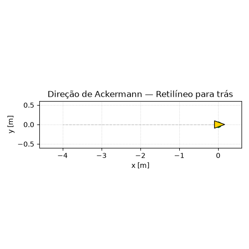
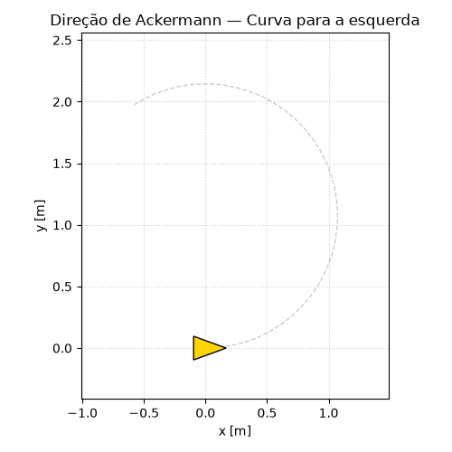
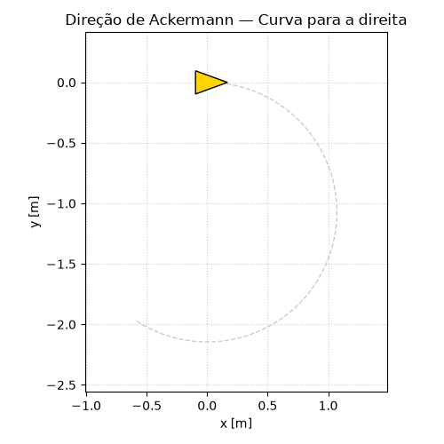

# Cinemática Diferencial e Simulação de Robôs Móveis

<p align="center">
  
</p>

Modelagem, simulação e análise da **cinemática diferencial** de dois robôs móveis
clássicos:

- **Tração diferencial** (uniciclo) — modelo cinemático clássico;
- **Direção de Ackermann** (modelo bicicleta) — esterçamento automotivo.

O projeto deduz as equações a partir das restrições de rolamento sem escorregamento,
implementa a **cinemática inversa** (geração de comandos) e a **cinemática direta** por
**integração numérica** (Euler e Runge–Kutta 4), e valida o comportamento nos quatro
cenários canônicos: frente, ré, curva à esquerda e curva à direita.

## Demonstração

Animações geradas por [`run_animations.py`](run_animations.py) (o triângulo amarelo é o
robô, orientado por `θ`; a linha tracejada é o caminho completo).

### Tração diferencial

| Frente | Ré | Esquerda | Direita |
|:---:|:---:|:---:|:---:|
|  |  |  |  |

### Direção de Ackermann

| Frente | Ré | Esquerda | Direita |
|:---:|:---:|:---:|:---:|
|  |  |  |  |

## Estrutura do repositório

```
.
├── src/robotica/
│   ├── models.py         # equações cinemáticas (diferencial + Ackermann)
│   ├── integrators.py    # integração numérica: Euler e RK4
│   ├── scenarios.py      # robôs, parâmetros e os 4 cenários de teste
│   ├── plotting.py       # gráficos de trajetória (X,Y) e de estados
│   └── animation.py      # animações GIF das trajetórias
├── run_simulations.py    # orquestrador: gera as figuras em outputs/
├── run_animations.py     # orquestrador: gera os GIFs em outputs/animations/
├── outputs/              # figuras geradas (16 PNGs) + animations/ (9 GIFs)
└── relatorio/            # relatório LaTeX + figuras TikZ (ver relatorio/README.md)
```

## Requisitos

- Python ≥ 3.12
- [uv](https://docs.astral.sh/uv/) (gerenciador de ambiente/dependências) — opcional
- Dependências Python: `numpy`, `matplotlib` (via `uv` ou `pip`, ver abaixo)

## Como executar

```bash
uv sync                              # cria o ambiente e instala dependências
uv run python run_simulations.py     # gera as 16 figuras em outputs/ (RK4)
uv run python run_animations.py      # gera os 9 GIFs em outputs/animations/
```

### Alternativa sem uv (pip + venv)

Caso não queira usar o `uv`, o projeto inclui um `requirements.txt`:

```bash
python -m venv .venv                 # cria um ambiente virtual
source .venv/bin/activate            # Linux/macOS  (Windows: .venv\Scripts\activate)
pip install -r requirements.txt      # instala numpy e matplotlib
python run_simulations.py            # gera as 16 figuras em outputs/
python run_animations.py             # gera os 9 GIFs em outputs/animations/
```

### Opções da simulação

```bash
uv run python run_simulations.py --integrator euler   # usa Euler no lugar de RK4
uv run python run_simulations.py --out figuras        # muda o diretório de saída
uv run python run_simulations.py --check              # verifica as figuras existentes
```

Cada execução regenera, para os 2 robôs × 4 cenários, dois gráficos:

- `outputs/<robo>_<cenario>_traj.png`   — trajetória no plano (X, Y);
- `outputs/<robo>_<cenario>_states.png` — evolução de `x(t)`, `y(t)`, `θ(t)`.

onde `<robo> ∈ {diffdrive, ackermann}` e `<cenario> ∈ {forward, reverse, left, right}`.

### Animações

`run_animations.py` gera, para cada robô e cenário, um GIF do robô percorrendo a
trajetória (`outputs/animations/<robo>_<cenario>.gif`), além do `hero_banner.gif`
(trajeto sinuoso em formato banner). São úteis para o vídeo explicativo. Opções:
`--integrator euler|rk4`, `--out <dir>`.

## Relatório

O relatório técnico (deduções, metodologia e análise) está em
[`relatorio/relatorio.tex`](relatorio/relatorio.tex). Instruções de compilação em
[`relatorio/README.md`](relatorio/README.md). As figuras de resultados do relatório são
as geradas em `outputs/`, então rode a simulação **antes** de compilar.

As figuras de geometria do relatório são desenhadas em **TikZ** (vetoriais, em
`relatorio/tikz/`) e as figuras de resultados vêm de `outputs/`.

## Mapeamento com o enunciado do trabalho

| Item do enunciado | Onde está |
|---|---|
| 1. Dedução matemática (diferencial + Ackermann) | `relatorio/relatorio.tex`, Seção 1 |
| 2. Cinemática inversa + gráficos dos 4 cenários | `src/robotica/scenarios.py`, `run_simulations.py`, `outputs/` |
| 3. Cinemática direta por integração numérica | `src/robotica/integrators.py` (Euler e RK4) |
| Animações para o vídeo | `run_animations.py` → `outputs/animations/` |
| Relatório PDF | `relatorio/` (compilar — ver abaixo) |

## Modelos — resumo das equações

**Tração diferencial (uniciclo):**

```
ẋ = v·cos(θ)     v = r·(ωr + ωl)/2
ẏ = v·sin(θ)     ω = r·(ωr − ωl)/b
θ̇ = ω
```

**Ackermann (bicicleta):**

```
ẋ = v·cos(θ)
ẏ = v·sin(θ)     R = L / tan(φ)
θ̇ = v·tan(φ)/L
```
